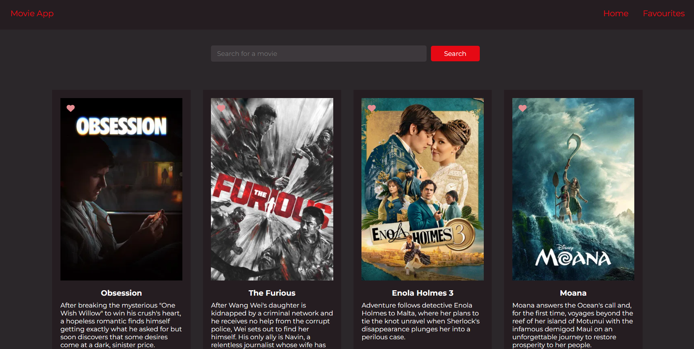

<div align="center">

# Movie App

A simple React movie browser powered by the TMDB API.

</div>

---

## Preview

<p align="center">
  
</p>

---

## Features

- Search movies by title
- Browse trending movies
- View posters and descriptions
- Add or remove favourites
- Persistent favourites using Local Storage
- Responsive interface

---

## Stack

- React
- JavaScript
- TMDB API
- CSS

---

## Setup

```bash
git clone https://github.com/Flamez06/movie-app.git

cd movie-app

npm install

npm run dev
```

---

## Environment Variables

Create a `.env` file.

```env
VITE_TMDB_API_KEY=your_api_key
```

Get your API key from:

https://developer.themoviedb.org/

---

## Notes

- Uses the TMDB API for movie data.
- Favourites are stored locally using Local Storage.
- Built to practice React, API integration, and state management.

---

<div align="center">

Built with React.

</div>
